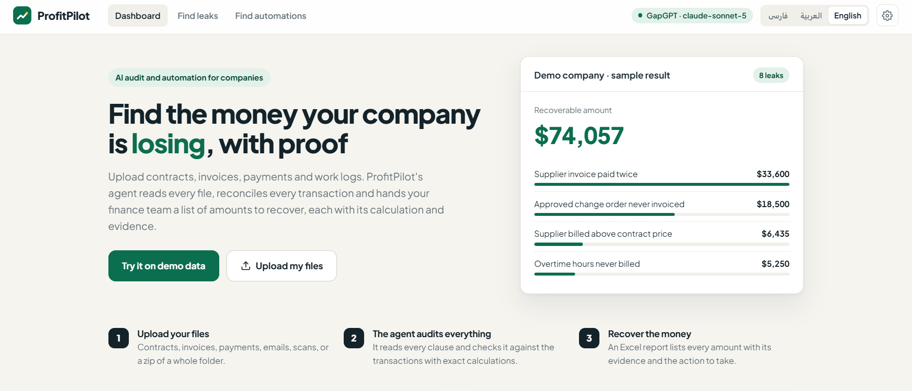
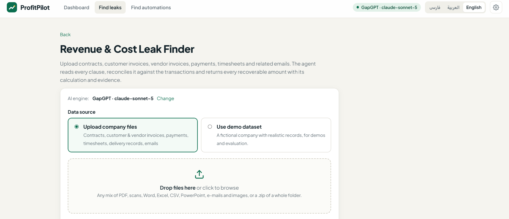

<div align="center">

# 📈 ProfitPilot

### AI agents that find the money a company is losing, and the manual work it can automate

**Every finding comes with its calculation, its evidence and the action to take.**


</div>

---



## 💡 What it does

A company uploads its records: contracts, customer and vendor invoices, payments, timesheets, delivery records,
e-mails and scans. An AI agent reads every file, reconciles it against the transactions with **exact calculations**,
and hands the finance team a report they can act on the same day.

| Module | You upload | You get |
|---|---|---|
| 💰 **Revenue & Cost Leak Finder** | Contracts, invoices, payments, timesheets, deliveries, e-mails | Every recoverable amount: unbilled work, missed price increases, underbilling, duplicate payments, supplier overcharges, missed discounts and unclaimed penalties |
| ⚙️ **Automation Discovery & Builder** | Activity logs, timesheets, helpdesk tickets, procedures, data exports | The manual work that costs the most in hours and money per month, plus **working Python automation scripts** the agent writes and tests on your own data |

> On the included demo company, the agent finds **8 planted leaks worth $74,057**, including a supplier invoice paid
> twice, an approved change order that was never invoiced and supplier prices above the contract.



## 🤖 How the agent works

```
Upload ─► Agent loop (Claude / OpenAI-compatible model)
            │  tools: list_files · read_file · view_image · run_python
            │         record_finding · write_automation · test_automation · finalize_report
            ▼
      Reads every file ─► writes & runs Python to reconcile ─► verifies each finding
            ▼
      Live dashboard ─► Excel report with calculation + evidence + action
```

- **Tool-using agent:** plans its own analysis, writes Python, runs it in a sandbox and checks the numbers before recording anything
- **Reads almost any file:** PDF (including scanned pages), Word, Excel (incl. legacy `.xls`), CSV, PowerPoint, e-mails with attachments, images and zipped folders, with Persian/Arabic encodings and digits handled
- **Live progress:** every file read, analysis and decision is streamed to the browser, including the code the agent ran
- **Cost control:** run modes, a token budget and prompt caching
- **Background jobs** that survive restarts, and an **Excel report** ready for the finance team
- **3 interface languages:** English, Persian and Arabic (RTL)
- **Tested** against an answer key for each demo dataset

## 🛠️ Tech stack

`Python` · `FastAPI` · `Anthropic API (tool use)` · `OpenAI-compatible API` · `pandas` · `pypdf` · `python-docx` ·
`openpyxl` · `Vanilla JS` · `Docker` · `pytest`

---

> 🔒 This is a commercial product, so the source code is private. This repository presents the project.
> For a demo or a version for your company, get in touch.

<div align="center">

Built by **[Mohammad Mohaghegh](https://github.com/mohagheghm511)** · [LinkedIn](https://www.linkedin.com/in/mohammad-mohaghegh) · [Devox](https://devox.ir)

</div>
